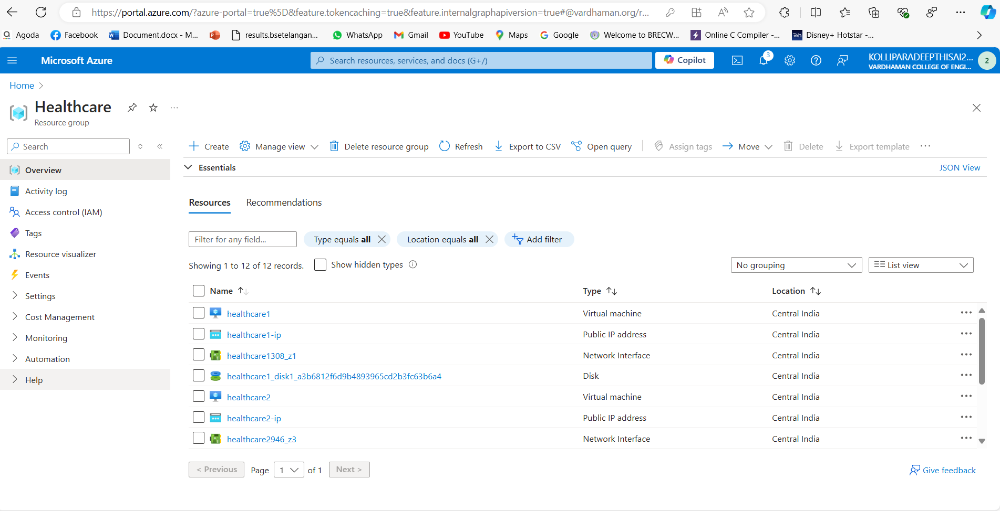
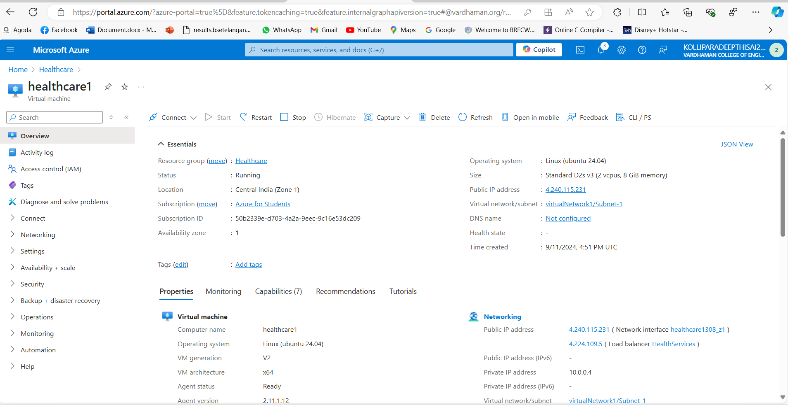
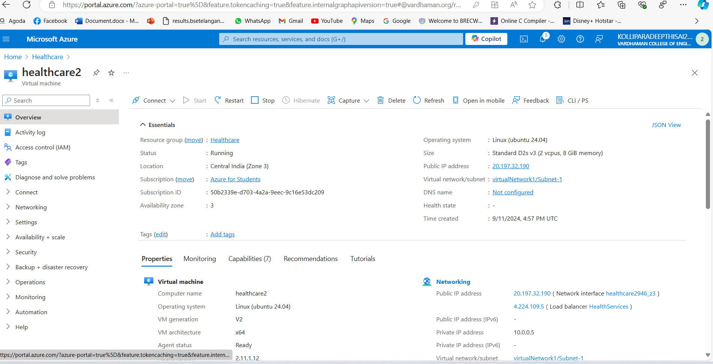
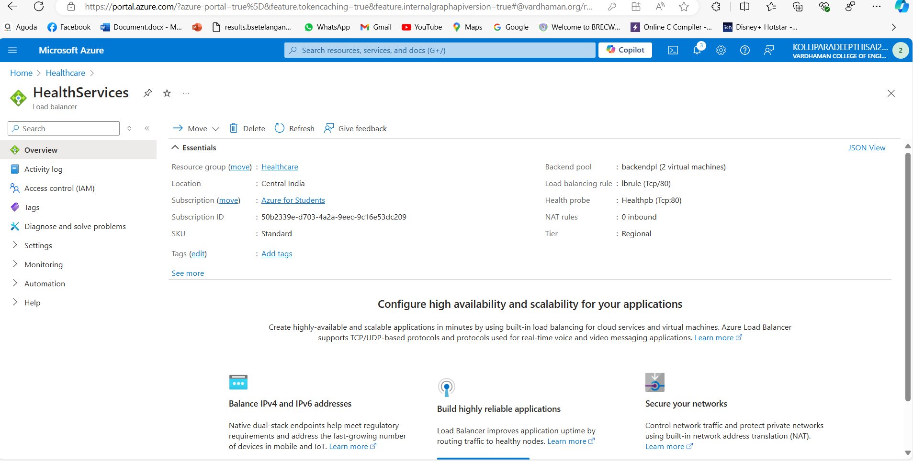
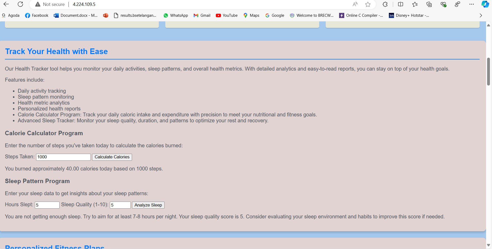
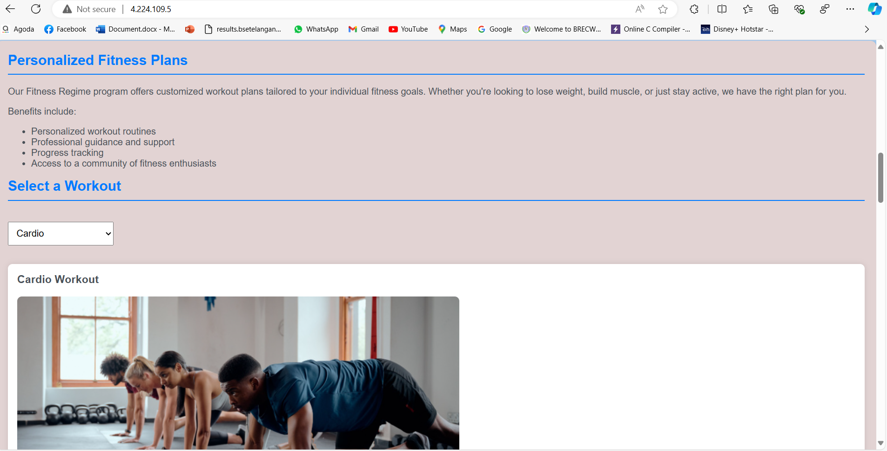
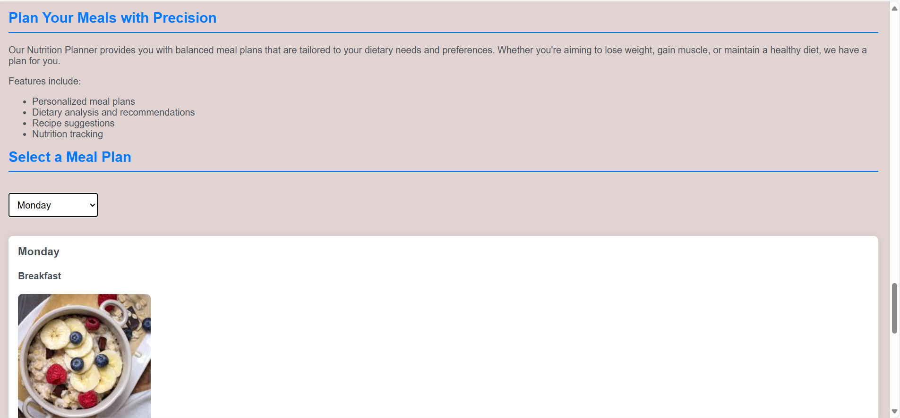

# Deploying Static Website using Load Balancer by ARM Template

## Project Overview

**Healthcare Services** is a comprehensive health and wellness website that helps users manage their fitness, track their health, and plan their nutrition efficiently. The website is divided into three main sections: Health Tracker, Fitness Regime, and Nutrition Planner, each providing unique functionalities to support users in achieving their health goals. This project aims to create a holistic platform that supports users in their journey towards better health through effective tracking, personalized workout plans, and nutritious meal suggestions.

This project demonstrates the deployment of **Healthcare Services** using Azure's ARM templates and load balancing across two Virtual Machines (VMs) in different availability zones for high availability and scalability. 

## Problem Statement

In an increasingly health-conscious society, individuals seek effective tools to manage and improve their overall well-being. Despite the abundance of standalone health apps and fitness trackers, users often find it challenging to integrate various aspects of their health, such as tracking physical activity, managing fitness routines, and planning nutritious meals, into a cohesive and user-friendly platform.  After building the website, the challenge was to deploy it on Azure using a load-balanced architecture for efficient traffic distribution.

## Project Goals

- Deploy the **Healthcare Services** website on Azure using ARM templates.
- Set up a **Virtual Network (VNet)** with two **Subnets** and a **Network Security Group (NSG)**.
- Use a **Load Balancer** to distribute traffic between two VMs located in different availability zones.
- Host the static website on these VMs and make it accessible via the load balancer's frontend IP.

## Technologies and Azure Services Used

1. **Azure CLI**: Used to create the resource group and Virtual Network.
2. **ARM Templates**: Automated the creation of VNet, subnets, and NSG.
3. **Azure Virtual Machines (VMs)**: Hosted the Healthcare Services website.
4. **Azure Load Balancer**: Distributed the traffic between two VMs to ensure high availability.
5. **Nginx**: Used as a web server on both VMs to serve the static content.
6. **Git**: Cloned the website from GitHub onto the VMs using a custom script.
7. **Custom Script Extension**: Used to automatically configure the VMs upon deployment.

## Project Steps

### 1. Website Development
- **Healthcare Services**:A static comprehensive health and wellness website that helps users manage their fitness, track their health, and plan their nutrition efficiently 
### 2. Deploying the Website on GitHub
- The frontend of **Healthcare Services** was uploaded to a public GitHub repository: [Healthcare Services](https://github.com/Indhu2024/Website.git).

### 3. Azure Deployment Using ARM Templates
- **Resource Group**: Created using Azure CLI to hold all the resources.
- **Virtual Network (VNet)**: Set up using an ARM template, which included two subnets for distributing the VMs.
- **Network Security Group (NSG)**: Applied inbound rules to allow traffic on ports 22 (SSH) and 80 (HTTP).
  
### 4. Virtual Machines Setup
- **VM 1**: Created in Availability Zone 1 using Azure Portal. Configured with:
  - Custom Script Extension to clone the website from GitHub.
  - Networking settings to connect to the VNet and assigned Subnet.
  
  Custom Script:
  ```bash
  #!/bin/bash
  sudo apt update
  sudo apt install nginx git -y
  cd /tmp && git clone https://github.com/Indhu2024/Website.git mysitee
  sudo rm -rf /var/www/html/index.nginx-debian.html
  sudo cp -r /tmp/mysitee/* /var/www/html/
  ```

- **VM 2**: Created in Availability Zone 3 with the same configuration as VM 1.

### 5. Load Balancer Configuration
- **Load Balancer**: Configured to distribute traffic between VM 1 and VM 2.
  - **Frontend IP Configuration**: Assigned a new frontend IP for external access.
  - **Backend Pool**: Added both VMs to the backend pool for traffic distribution.
  - **Load Balancing Rule**: Defined to balance HTTP traffic (port 80) across the VMs.
  - **Health Probe**: Set up to monitor the health of the VMs and ensure traffic is routed only to healthy VMs.

### 6. Testing and Accessing the Website
- After the load balancer deployment, the website became accessible via the frontend IP of the load balancer. Users can interact with **Healthcare Services** to generate outfits from their clothing uploads.

## How to Use Healthcare Services

### 1. Health Tracker
**Steps and Calories Burned:**
 - Input: Users can enter the number of steps they have taken.
 - Output: The website calculates and displays the number of calories burned based on the entered steps.

**Sleep Tracker:**
 - Input: Users can provide details on the number of sleep hours and the quality of their sleep.
 - Output: The system offers personalized suggestions to improve sleep quality, based on the provided data.

### 2. Fitness Regime:
**Workout Guides:**
 - Categories: Input categories that include cardio, strength training, and flexibility exercises.
- Content: Each workout type is accompanied by:
  - An image demonstrating the exercise.
  - A step-by-step description of how to perform the exercise correctly.

### 3. Nutrition Planner
**Meal Planning:**
 - Input: Users select a day of the week.
 - Output: Displays a set of healthy food options for all three meals (breakfast, lunch, and dinner) for the selected day.
 - Additional Information: Includes tips for healthy eating and alternate food options.


## Azure Services and Tools Used

- **Azure CLI**: Resource group creation and management.
- **Azure Resource Manager (ARM) Templates**: Infrastructure-as-Code to deploy resources.
- **Virtual Network (VNet)**: Networking and subnetting.
- **Network Security Group (NSG)**: Security rules for VM access.
- **Azure Virtual Machines**: Hosting the website on multiple VMs.
- **Azure Load Balancer**: Load balancing between VMs.
- **Nginx**: Web server for hosting static content.
- **Git**: Version control and cloning the website onto VMs.
- **Custom Script Extension**: Automated configuration of VMs.

## Live Website and Resources

- **Website Link**: [Healthcare Services](https://github.com/Indhu2024/Website.git)
- **Project Video**: [Project Video](https://drive.google.com/file/d/1RyNTaPkZvLWLOdgI584FnFTLeZhatIZL/view?usp=drive_link)
- **Screenshots**:
  **Created Resource Group Screenshot**
  - 
    
  **ResourceGroup Deployment Command Output**
  - 

  **VNet Subnets RSG ARM Template Output**
  - 

   **Created VNet Screenshot** 
  - 

  **Created Subnets Screenshot**
  - 

   **Deployed VM 1 Screenshot**
  - 

  **Deployed VM 2 Screenshot**
  - 

  **Deployed LoadBalancer Screenshot**
  - 

  **Website Home Page Screenshot**
  - 

  **Health Tracker Page after complete Deployment**
  - 

  **Fitness Regime Page after complete Deployment**
  - 

  **Nutrition Planner  Page after complete Deployment**
  - 


## Conclusion

This project showcases the end-to-end process of deploying a static website using Azure's ARM templates and load balancing capabilities. By distributing traffic between two VMs in different availability zones, we ensure high availability and scalability for the **Healthcare Services** platform. The integration of Azure's powerful tools and services simplified the deployment and configuration process.

## Author

**Indhu Reddy Yerra** 

**John Nikhil**

**Charitha**

- Deployed all group members together as part of learning Azure's cloud infrastructure.
